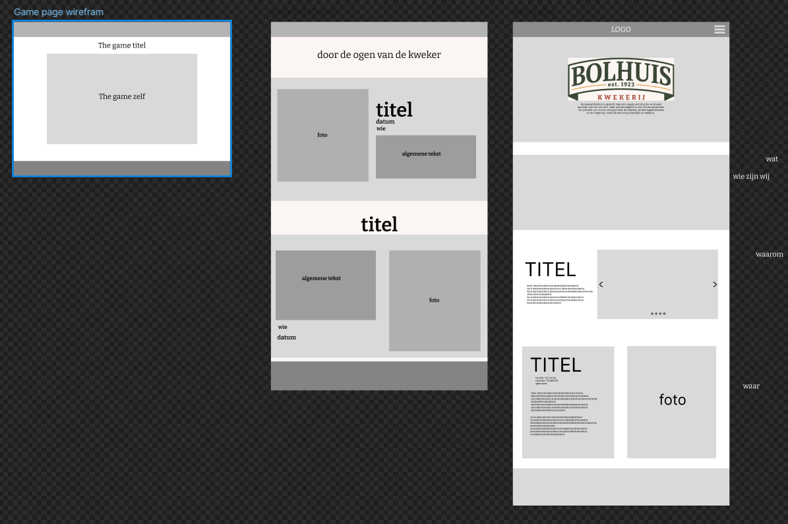
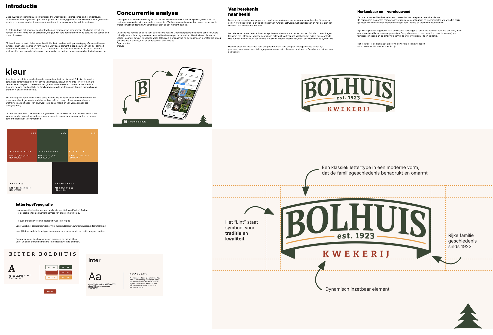
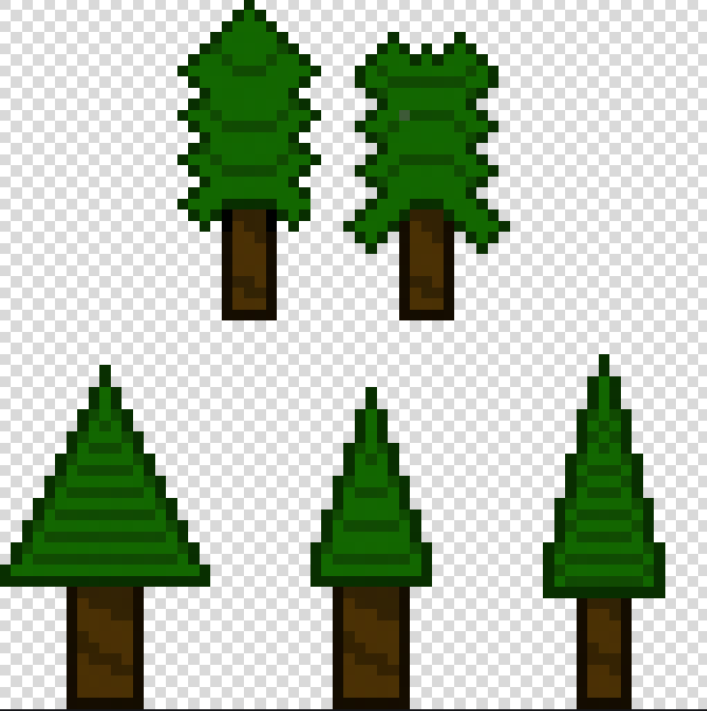

# toeligting 

## wireframes en design

 

hierboven zijn de wireframes voor de webdesign van de deepdive.

### Rechts

de linker is de hoofdpagina en hier zijn we gegaan voor een hero om de logo te laten zien en een eerste indruk maken. 

daar onder hebben we gekozen om zo veel mogelijk informatie mee te geven. hier splitsen we de pagina in stukken van Wat/wie wij zijn, Waarom met fotos en waar dus waar kan de gene die website ziet naartoe. 

### midden 

in het midden is de pagina voor de blogs hier kan martin verhalen delen over het leven "door de ogen van een kweker" hier kan iemand ook alleen fotos delen voor dat is voor zijn broertje. 

we hebben voor de kaarten twee designs waaruit we kunnen we zijn gegeaan voor de bovenste omdat die meer overzichtelijk is.

### Links

hier is de pagina voor de game als het lukt om het in de web te krijgen. als het niet lukt is het makkelijker om een link voor een download te maken.

## moodboard

 

voor styling hadden we een brandbook gekregen dus alle klueren typografie en logo was all voor ons bepaald. wat alleen de layout en hoe wij de klueren toepassen overhoudt voor ons.

## Game 

Voor de game hebben wij een kleine 2D platformer gemaakt waar in je naar de bomen die ze bij bolhuis kwekerij verkopen toe kan lopen en daar staat dan wat informatie over de boom bij.

 